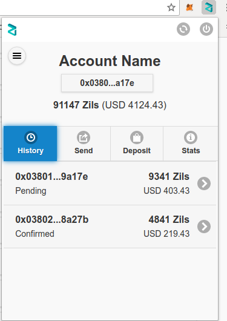

# Zilliqa Browser-Extension

Zilliqa Browser Extension is a chrome based extension for allow websites to access data from Zilliqa Block Chain and allow users to
manage their identities securely and sign transactions.

## User Interface and Features

    - Setting up the Password and Seed Phrase
        -- Under Development
    
    - Login Screen
    
    
    - Password Reset using Seed Phrase
    
    
    - Home Screen
    
        
    
        -- Account Details Section
        
        -- History
        
        
        -- Send (Under Development)
        
        -- Deposit (Under Development)
        
        -- Stats: Provides updated statictical information about Zilliqa Cryptocurrency.
        
        
        
        
    - Accounts (Under Development)
        -- Show Existing Accounts
        -- Import account
        -- Create new account
        -- Remove an account
        
        
    

