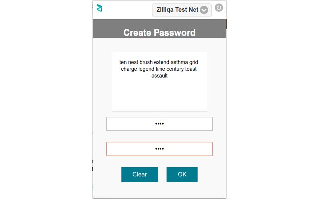
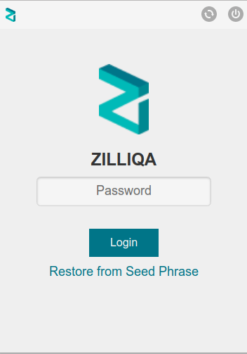
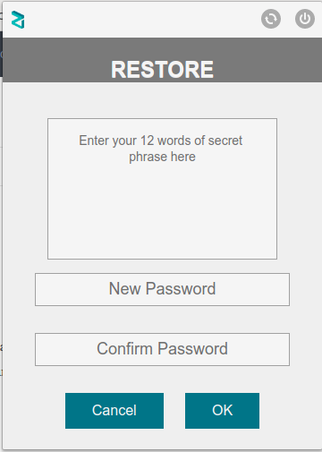
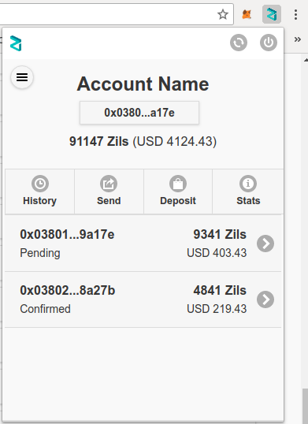
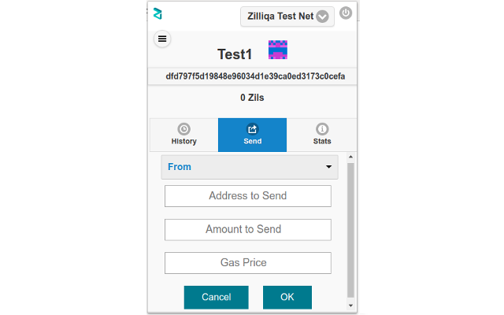
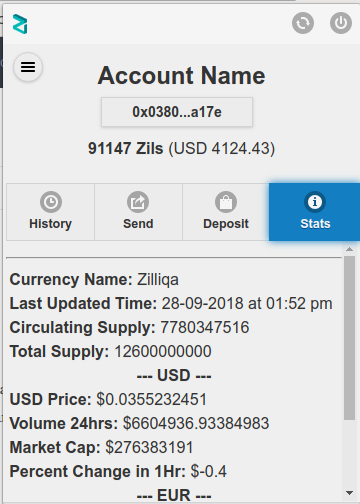
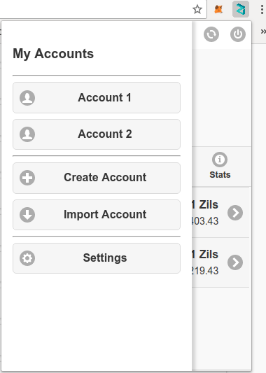

# Zilliqa Browser-Extension

Zilliqa Browser Extension is a chrome based extension for allow websites to access data from Zilliqa Block Chain and allow users to
manage their identities securely and sign transactions.

## User Interface and Features

### Setting up the Password and Seed Phrase

    
### Login Screen


    
### Password Reset using Seed Phrase


    
### Home Screen
    

    
- Account Details Section
- Send


        
- Receive (Under Development)
- Stats: Provides updated statictical information about Zilliqa Cryptocurrency.


    
    
    
    
### Accounts (Under Development)
- Show Existing Accounts
- Import account
- Create new account
- Remove an account
        



## Manual Installation Steps
```sh
1. Clone Repo: $ git clone https://github.com/qaidjohar/Zilliqa-Browser-Extension
2. Open Chrome Web Browser --> Tools --> Extensions
3. Click Load Unpackaged --> Browse the Repo Directory --> Click Open.

Done...Zilliqa Browser Extension Loaded Successfully.
```

## Install from Chrome Store
1. Go To: [Green Wallet Chrome Store Link](https://chrome.google.com/webstore/detail/green-wallet/afmpijpoenjincdlhebfccmcmfkdkdjc)
2. Click Add to Chrome
Done...Zilliqa Browser Extension Loaded Successfully.

