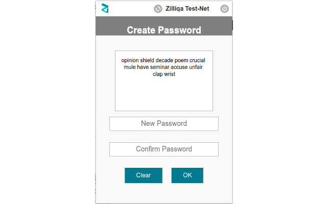
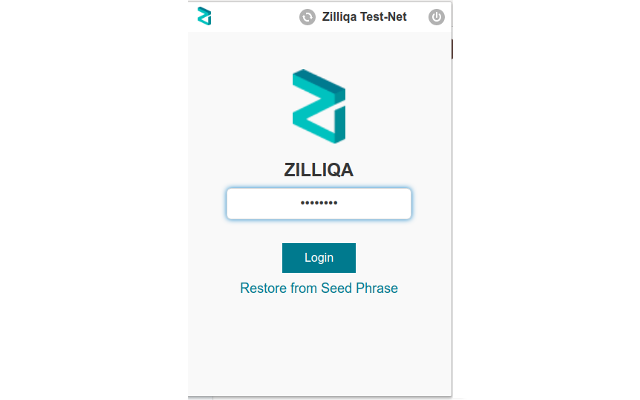
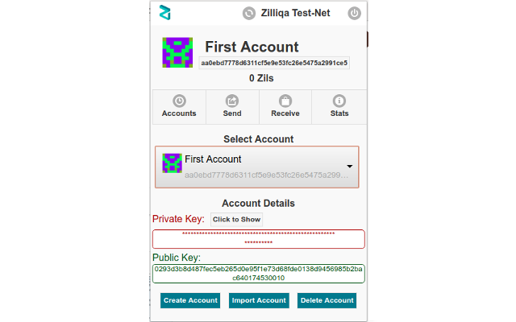
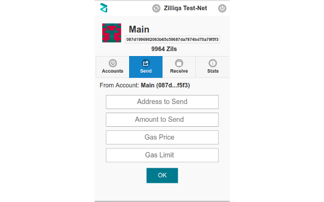
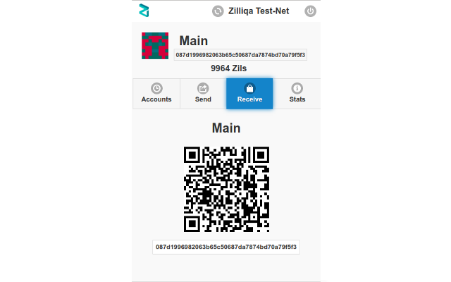
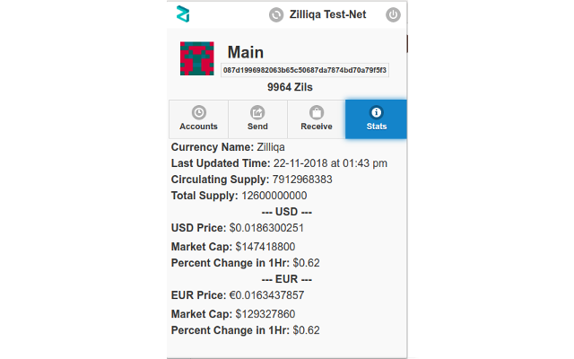

# Zilliqa Browser-Extension

Zilliqa Browser Extension is a chrome based web browser extension which provides an interface to the users to communicate with the Zilliqa Blockchain. 

This Project is under development, funded by [Zilliqa Ecosystem-Grant Program](https://blog.zilliqa.com/announcing-the-first-zilliqa-ecosystem-grant-awardees-4ccb39ef83c9). 


## Features Completed

The following are the features and functionalities of the extension.

1. Mnemonic Code Generation and Display
2. User Password Setup
3. User Login
4. User Password Forget/Reset Functionality
5. Account Creation and setting its Account Name
6. Account Import using its Private Key
7. Account Deletion with Confirmation
9. Easy Account Switching from Accounts Tab
10. Fetching Live Account Balance
11. Pivate key Hide and View Functionality
12. Create Transaction to Send Balance
13. Receive Balance using QR Code
14. Live Zilliqa Market Statistics
15. OnClick Copy address to Clipboard


## Zilliqa Test-Net Details

1. Node Provider: https://api-scilla.zilliqa.com
2. Scilla Provider: https://scilla-runner.zilliqa.com
3. Node Explorer: https://explorer-scilla.zilliqa.com

## Manual Installation Steps
```sh
1. Clone Repo: $ git clone https://github.com/qaidjohar/Zilliqa-Browser-Extension
2. Open Chrome Web Browser --> Tools --> Extensions
3. Click Load Unpackaged --> Browse the Repo Directory --> Click Open.

Done...Zilliqa Browser Extension Loaded Successfully.
```

## Install from Chrome Store
1. Go To: [Green Wallet Chrome Store Link](https://chrome.google.com/webstore/detail/green-wallet/afmpijpoenjincdlhebfccmcmfkdkdjc)
2. Click Add to Chrome

Done...Zilliqa Browser Extension Loaded Successfully.


## User Interface

### User Password Setup and Seed Phrase Generation

    
### User Login Screen


    
### Home Screen


    
### Send Amount - Perfrom Transaction

        
### Receive Amount using QR Code


### Stats: Provides updated statictical information about Zils.


    
    
